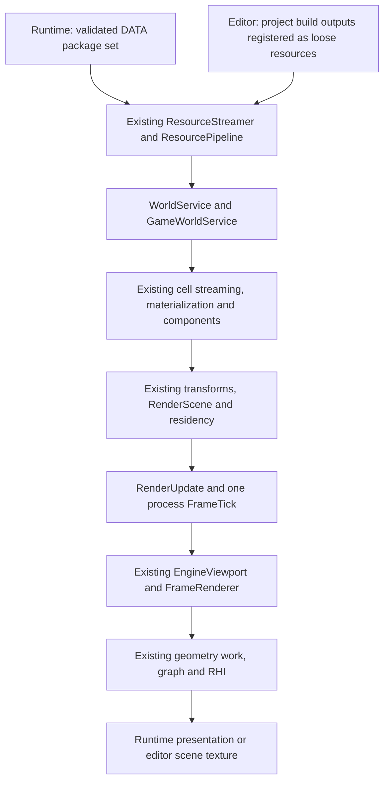

# World execution and rendering integration

Study checkpoint: 2026-09-11. Proposed implementation sequence: **10.4.1–10.4.7**.
These phases continue the unfinished executable integration after the 10.3
compile-and-link checkpoint. They do not replace the broader Phase 10 lifecycle,
image, surface-coverage and performance acceptance criteria.

The original study below is retained as the baseline. The 10.4.1 implementation
checkpoint at the end records subsequent changes and compilation results.

This checkpoint is source study only. No engine implementation, project
generation, compilation, tests, package rebuild or application launch was
performed for this study. Earlier build/package results belong to their own
checkpoints. The shared worktree contains substantial unrelated changes.

## Finding

The world-to-renderer machinery exists. The missing pieces are production
composition and several incomplete contracts between its owners. Adding another
loader, materializer, render-world copy, batcher or frame executor would duplicate
working foundations without resolving those contracts.

The assembled `DATA000.vpak` is a useful cooked fixture, but it is not yet a
complete runnable rendering image. It contains ten resources: input, prefab,
mesh, material, two material shader programs, two material pipelines, cell and
world. Renderer feature programs/pipelines are absent. Its material depth state
also conflicts with the current camera convention. Package integrity and resource
type checks did not establish executable readiness.

Runtime and editor must converge at the existing resource and world APIs:

Renderer bootstrap resources also use `S`; their lifetime starts before world
activation and outlives a world session. Runtime gameplay cameras and editor
navigation cameras supply explicit view bindings to `V`.

## RED evidence and what to reuse

References below are to the local RED checkout at
`D:/root/R6.Root/Mainline/dev/src`. This is architectural/source evidence, not a
claim that either executable was run during the study.

| Concern | RED source evidence | Vanguard consequence |
| --- | --- | --- |
| Different resource suppliers, common loading | `common/resource/src/resourceGameDepot.cpp`, `ResourceGameDepot::CreateResourceAsyncSource` (259); `fileSystemResourceDepot.cpp`, `FileSystemResourceDepot::CreateResourceAsyncSource` (62); `resourceEditorDepotImpl.cpp` (15); `common/redReflection/src/resourceLoader.cpp`, `ResourceLoader::Initialize(IResourceDepot*, bool)` (49) | Keep package and project-derived source adapters under the existing streamer. Preserve common typed identity, dependency loading, decoder and materialization behavior. RED's cooked/uncooked distinction does not mean raw FBX is a runtime mesh. |
| Renderer startup resources precede drawing | `common/renderer/src/renderInterface.cpp`, `CRenderInterface::InitDevice` (1310); `renderShaderMap.cpp`, `CRenderShaderMap::Init` (84); `common/shaderCache/src/shaderCacheManager.cpp`, `CStaticShaderManager::Init`/`LoadCache` (159/197) | Complete the existing renderer catalog and shader-map startup. Cook feature resources using existing tools. Do not adopt RED's development compiler-launch fallback in shipped runtime. |
| Gameplay supplies its camera | `common/gameFramework/src/gameStateMachineImpl.cpp`, `ProcessRender` (431), camera registration/issuance (472/475) | A loaded camera component is not automatically the viewport's selected camera. Selection belongs to the caller/gameplay binding. Do not copy RED's literal camera slot zero into Vanguard's generation handles. |
| Editor supplies its camera differently | `backend/backendEngine/src/renderingWindow.cpp`, `UpdateAndRender` (132), camera preparation (149), registration/issuance (199/201) | Editor navigation can provide a camera for the same scene/render APIs without requiring a cooked gameplay camera component. |
| One common frame boundary, then viewport submissions | `common/gameFramework/src/gameEngine.cpp` (839/884/895 and 922/989/1012); `backend/backendEngine/src/renderingWindowManager.cpp` (94–128) | Keep one process `FrameTick`, followed by the relevant viewport frames. Do not repeat global GPU-table updates per editor window or camera. |
| Shared rendering command path | `common/engine/src/renderEngineViewport.cpp`, `EngineViewport::BeginFrame` (387), `SubmitFrame` (445), regular `RenderScene` submission (638); `common/renderer/src/renderCommandHandler.cpp`, `FrameTick` (870), `RenderScene` (908) | Use the existing `BeginFrame`/`ConfigureViews`/`SubmitFrame`, command chain, jobs and graph. The existing visible preparation inside `FrameRenderer` remains appropriate. |

There is no single RED file to copy verbatim to close this work: Vanguard already
has the corresponding subsystems, with different resource formats, managed
service lifetimes, generation handles, RHI and ImGui integration. Reuse matching
ownership and sequencing. Any newly discovered missing algorithm should receive
its own targeted RED comparison before implementation. Porting RED depot classes,
global objects or viewport IDs alongside their existing Vanguard equivalents
would create a second implementation.

## Existing implementation to retain

- `ResourceStreamingService` owns `ResourceStreamer`, `PackageSetMount` and the
  artifact decoder callback state. `RegisterLoose`, transactional package mounts
  and `OpenSource` already resolve the winning resource source; mesh/texture
  ranged reads need no separate source registry.
- `WorldService`, `GameWorldService`, `CellStreamingSystem`, `CellMaterializer`
  and `ComponentDirectory` already execute asynchronous world loading and
  concrete component activation. Static mesh, light and camera components exist.
- `RenderingRuntime`, transform jobs, mesh/material/texture residency and
  `RenderScene` already prepare and publish component contributions. Geometry
  shells/bins and GPU Scene are the accepted draw-data owners.
- `RenderingService` registers renderer update/frame participants and connects
  `FrameRenderer` to `RenderCommandSystem`. The geometry graph, indirect draw
  recording, directional diffuse, output composition and bounded diagnostics
  have implementations.
- `ViewportManager`, `EngineViewport` and `PresentationService` already manage
  output acquisition/submission. The editor UI already uses these for its native
  host windows. Texture viewports are also an existing rendering output kind.

These are source-level facts; they do not substitute for exercising the complete
production path with real resources and a native device.

## Confirmed gaps and their owners

### G1. Source lifetime and world-session lifetime are coupled

[`WorldSessionService`](../../source/engine/src/world_session_service.cpp) rejects
an already mounted package set during initialization. `Begin` requires package
mount state even when an explicit world resource is supplied. Its input request
comes from the package boot record, and `ReleaseEverything` unmounts the set.

That prevents the intended project-derived-only editor session and conflicts
with loading shared renderer resources from packages before renderer startup.
The editor currently substitutes `Builds/Windows/Development` into the same
package-dependent request; reading `.vproject` is not a loose-resource adapter.

Physical ownership already belongs to
[`ResourceStreamingService`](../../source/engine/src/resource_streaming_service.cpp).
Complete its source lifetime and make world/input session ownership explicit.
Avoid a new depot manager or a second package-mount implementation.

### G2. Renderer bootstrap has consumers but no production catalog producer

[`RenderingServiceConfig`](../../source/engine/include/vanguard/engine/rendering_service.hpp)
already accepts named shader/pipeline resources and a catalog source-service
dependency. Both application compositions leave the feature catalogs empty.
The bootstrap package contains material programs, which do not replace renderer
compute and composition programs.

[`AreGeometryGraphPipelinesReady`](../../source/rendering/src/geometry_graph_nodes.cpp)
requires all thirteen geometry compute stages plus `ResolveCameraOutput` and
the selected `DirectionalDiffuse` or `VisualizeGBuffer` pipeline.
`GeometryDiagnostics` is additionally required when those diagnostics are enabled.
The compile-only shader driver did not publish these as runtime resources.

The existing boot record identifies world/input but has no renderer-catalog
reference. A bounded, versioned description of the renderer resource closure and
its discovery is needed. It must supply existing shader/pipeline APIs, not become
a shader cache, scheduler or executable graph format of its own.

### G3. Draw phases and native binding ABI are not composed into worlds

[`GameWorldService::Configure`](../../source/engine/src/game_world_service.cpp)
has no production caller in the inspected runtime/editor paths.
`RenderingRuntimeConfig::meshDrawPhases` is empty by default.
`StaticMeshComponent::Start` requires these phases; `CameraComponent::OnAttach`
constructs its phase set from them, and camera validation rejects an empty set.
World loading alone cannot supply renderer attachment signatures.

`RenderingServiceConfig::materialBindingLayouts` is also empty in production.
Generated static surfaces require the existing 24-byte
[`StaticSurfaceDrawContext`](../../source/rendering/include/vanguard/rendering/mesh_draw_layout.hpp)
push-constant interface and bindless descriptor domains. The native static-surface
proof explicitly constructs that layout; production composition does not.
Renderer compute/composition pipelines likewise require their reflected binding
interfaces. Reuse existing shader reflection, layout validation and pipeline
factory rather than inventing a second binding description per shader.

The renderer must own one authoritative phase/attachment/depth and draw-ABI
contract. Cooking, world configuration and output pipeline selection must agree
with it. Component serialization must remain free of native handles and PSO state.

### G4. Active views and streaming observers have no production supplier

[`CameraComponent`](../../source/entities/src/scene_components.cpp) intentionally
registers a camera without replacing a viewport's current selection. Neither
production application currently binds the loaded camera to world rendering.
The existing world/boot data does not name the fixture's startup camera.

Runtime needs an explicit selection from startup/gameplay data. Editor navigation
can supply a different camera through the same rendering API. A serialized
selection must identify an entity/component within a world instance, not a
transient renderer slot. Existing materializer identities and component handles
provide the resolution machinery; do not search all entities for the first camera.

`ComponentDirectory::Find(entity, stableId)` indexes the entity and searches only
its components. Resolve a configured selection at attachment/rebinding, retain a
generation-checked handle, and avoid repeating that search for every view/frame.
`StreamingObserverService` exists but has no selected-camera producer in these
application paths; it falls back to world origin. Streaming observers must be
explicitly registered/updated by the appropriate controller, because a render
view is not necessarily a streaming source.

### G5. Runtime frame supply and editor scene-texture handoff are absent

[`RuntimeApplication`](../../runtime/src/runtime_application.cpp) runs the frame
pipeline but does not create/bind a presentation output or submit world views.
The necessary viewport and presentation APIs already exist.

[`EditorUiRenderer`](../../editor/framework/src/editor_ui_renderer.cpp) submits
overlay frames. That is not a world view. Its existing `PresentationService`
owns native UI outputs; a scene panel must not attach another swapchain to the
same native window. Render the scene into an existing texture viewport and
publish it through the editor texture interface.

There is a real handoff contract to finish:
[`EditorTextureDesc`](../../editor/framework/include/vanguard/editor/editor_ui.hpp)
contains texture, sampler and color space, but no producer completion or current
resource state. UI imports currently use the texture creation descriptor's
`initialState` as both initial and terminal state. A live scene output must have
an explicit producer/consumer ordering and state contract. It may use ordered
Graphics submissions when that is the actual producer queue; CPU job completion
must not masquerade as GPU completion. Use existing graph imports and RHI receipt
mechanisms for any required wait. A retained texture handle alone is insufficient.

Output encoding also needs an explicit minimal policy. Camera color is linear
RGBA16F; the current visualization/copy shader performs no display transfer
conversion. Presentation defaults to preferring HDR10. Select a supported output
format/color space from the actual output and validate its resolve pipeline.
Simple SDR presentation is sufficient for this milestone, but must be declared
and encoded correctly. PBR, exposure and a mature HDR/composition stack remain
separate work.

### G6. Stop/drain progress is not a complete terminal contract

[`GameWorldService::StopWorld`](../../source/engine/src/game_world_service.cpp)
drains world/materialization work, then treats `RenderingRuntime::ReleaseScene`
failure as terminal. `RenderSceneManager::DestroyScene` can return `Busy` while
GPU publication/retirement or scene jobs are pending.
`RenderSceneGpuPublisher::DetachScene` explicitly rejects outstanding dirty
records and retirements. Application session-stop polling does not run the
normal rendering update/frame-tick sequence that ordinarily advances this work.

This is a confirmed control-flow mismatch. A hang or failure on a particular
native run has not been reproduced in this study. Implement a pending drain
through the existing render command/publication/receipt owners; do not add a
fixed sleep, fabricated frame/fence value or private retirement queue.
Source unmount must occur after all consumers, including engine-lifetime
renderer consumers, have released their source/resource ownership.

### G7. The cooked fixture needs semantic corrections

[`bootstrapImage`](../../tools/bootstrapImage/src/main.cpp) currently writes
`LessEqual` depth pipelines. Cameras default to reverse depth;
`GeometryFrameWork::PlanShellDraws` rejects the mismatch as
`IncompatibleDepthConvention`. Correct the cook contract rather than weakening
that check or forcing an arbitrary camera convention in the executable.

Its quad vertices are centered at z=5, but the mesh sphere center is left at
zero with radius 1.9; the placement bounds are only [-1,1]. These do not enclose
the fixture geometry. The current static-mesh proxy uses the mesh AABB and GPU
Scene derives its sphere from that box, so the bad serialized sphere is not
itself evidence of a current GPU culling failure. The cell is always loaded;
that also does not make its placement bounds valid. Fix generated metadata.

`BuildResource` supplies a constant source byte string. Generated-resource
fingerprints are connected, but shader templates/includes and procedural recipe
inputs are not fully represented in source dependencies. An old DDC hit can
therefore survive a recipe/template change without an explicit version change.
Use the existing BuildSystem/DependencyIndex dependency facilities and compiler
versions; do not introduce another cache or rely on deleting DDC to recook.

The fixture's float vertex stream matches its declared layout. It does not prove
quantized/packed layouts or all earlier surface permutations. Package reopening
checks presence/type, not these cross-resource semantic contracts.

## Implementation phases

### 10.4.1 — source ownership and source-independent world sessions

Owners: engine resource-streaming/session services; runtime and editor composition.
Closes G1 and establishes the lifetime boundary needed by G2/G6.

- Make the existing resource-streaming owner responsible for mounting and
  releasing process-lived sources at ordered service boundaries. Keep source
  provider objects/readers alive through all requests and ranged reads.
- Runtime derives source configuration from the validated DATA boot record.
  Editor publishes committed derived output identities, dependencies and physical
  locations through `RegisterLoose`; packaged fallback is explicit and optional.
- Change the world-session start contract to explicit typed world/input choices,
  including an explicit no-game-input policy for edit-only worlds. World changes
  must not accidentally destroy shared renderer sources or retain stale input.
- Use the service dependency DAG to establish sources before renderer catalogs,
  and release them after renderer shutdown. Remove the contradictory exclusive
  package assumption; do not add another source-service hierarchy.

Acceptance: inspect startup/rollback/shutdown order for package-only and
loose-only sources, world replacement and failed source registration. Existing
world and resource decoders remain the only downstream path.

### 10.4.2 — renderer resource cooking and bootstrap discovery

Owners: existing shader/material/build/package tooling and renderer startup.
Depends on 10.4.1; closes G2 and the fixture dependency problem in G7.

- Add the bounded renderer bootstrap description and its typed discovery link.
  Recommended representation: one cooked resource referenced from the DATA boot
  record; the editor supplies an equivalent explicit reference from its source
  catalog. Apply normal format-version/dependency rules. Final binary schema
  must be settled against existing package/reflection formats before coding.
- Record the existing feature identities and shader/pipeline resource references;
  publish the thirteen compute stages, selected composition/output programs and
  optional diagnostic program through the production compiler/build pipeline.
  These resources are reusable engine content, not embedded fixture byte arrays.
- Pass the resolved records into the existing shader map and pipeline factories.
  Check required entries, backend payloads, reflected layouts and feature support
  before activating a rendering world. A disabled renderer/headless use remains
  an explicit supported configuration.
- Track source/includes/settings/compiler versions in existing build keys so
  runtime packages and editor loose outputs represent the same cooked closure.

Acceptance: a produced catalog resolves every required typed dependency; missing
or incompatible entries identify the failing feature/resource during startup.
Runtime contains no compiler and no bootstrap-specific resource paths.

### 10.4.3 — renderer/world draw contract and fixture compatibility

Owners: rendering composition, `GameWorldService`, existing material cook recipes.
Depends on 10.4.2; closes G3 and the depth/bounds parts of G7.

- Expose the selected renderer's phase/attachment/depth contract and use it to
  configure worlds before component activation. Resolve durable phase keys with
  the existing registry; never assume particular compact phase indices.
- Install the existing static-surface native ABI and validate feature bindings
  against reflected shader interfaces. Keep layout lifetime in RenderingService
  and material/pipeline owners, with no material ownership in the flow allocator.
- Make generated pipeline state and actual graph attachment formats agree.
  Correct the fixture's reverse-depth mismatch and conservative bounds at cook
  time. Share contract definitions/validation rather than maintaining equivalent
  literal attachment tables in application startup and the fixture generator.

Acceptance: decoded fixture material/mesh programs match the selected renderer's
phase, vertex/instance, binding, depth and attachment interfaces. Camera and mesh
attachment receive a valid phase context through the normal world runtime.

### 10.4.4 — camera activation and streaming-observer binding

Owners: existing world/session/component APIs and the runtime/editor view controllers.
Depends on 10.4.3; closes G4.

- Add an explicit startup view/camera selection to the appropriate startup/game
  data contract. Use a world-scoped entity/component locator resolved through
  existing materializer identities; never serialize a `RenderCameraHandle`.
  A caller that owns an editor camera supplies that handle explicitly instead.
- Bind/unbind on readiness, camera replacement, component detach and world
  change. Do not introduce another all-camera directory or scan the world.
- Feed chosen streaming observers with controller position/velocity and explicit
  primary policy through the existing observer service. Do not make every
  reflection, preview or UI view a streaming observer automatically.
- Preserve the distinction between session running, components attached, draw
  resources resident and a view ready. Continue normal asynchronous progress
  while loading; waiting for full mesh residency before allowing renderer
  maintenance would prevent the work needed to reach residency.

Acceptance: selection survives asynchronous attachment and fails visibly for a
wrong identity/type; switching or removing it cannot use a stale handle. Editor
navigation and runtime gameplay can select different cameras for the same world.

### 10.4.5 — production viewport frames and editor scene output

Owners: application frame suppliers, existing viewports/presentation and editor UI.
Depends on 10.4.3–10.4.4; closes G5.

- Runtime creates its presentation output from the actual selected native window
  and output capabilities using `PresentationService`. Configure the ordinary
  engine viewport with the world scene, explicit root cameras and output regions.
- Register frame supply after `RenderingFrameTickParticipantId`. Use existing
  `BeginFrame`, `ConfigureViews`, `SubmitFrame` and abandonment paths. Multiple
  views/regions and offscreen producers retain the existing graph dependencies;
  global GPU Scene work stays once per process frame.
- Editor renders scene panels into texture viewports and publishes retained
  texture generations through its existing texture API. Complete producer
  ordering/state/receipt handoff at that API/import boundary. If ordered Graphics
  submission is used, prove that ordering and its terminal resource state.
  The UI keeps its existing native-window output owner and ImGui stays editor-only.
- Establish minimal correct output encoding and format-compatible resolve
  selection for runtime and editor. Use actual dimensions and output formats,
  and explicit empty/loading/minimized behavior.

Acceptance: both suppliers enter the same world-rendering frame path. Every
begun frame has a submission or abandonment; a scene texture cannot be sampled
before its producer or reused after its generation retires. No private graph,
swapchain, direct-geometry fallback or per-viewport global update is added.

### 10.4.6 — session replacement and terminal draining

Owners: `WorldSessionService`, `GameWorldService`, `RenderingService`, frame/output
suppliers and existing source owners. Depends on the ownership from 10.4.1 and
the consumers from 10.4.4–10.4.5; closes G6.

- Stop admitting world-view frames, join outstanding CPU recording through the
  existing render tail, remove view/observer bindings, and advance component
  detach plus GPU publication/retirement until scene release is legal.
- Preserve `Pending` for legitimate busy states and a concrete failure for actual
  errors. Keep required renderer progress available while an application state
  is stopping; do not call the entire gameplay frame recursively from stop.
- Retire output/texture generations and resource closures using actual submitted
  queue receipts. Unmount sources only after their final engine/world consumer.
- Cover cancellation during loading, partial startup failure, no drawable view,
  output loss/resize, world replacement and final shutdown. Use the existing
  terminal device-failure policy rather than waiting for a fence that cannot finish.

Acceptance: every asynchronous ownership path can finish once or report a
specific terminal failure. The first executable proof includes shutdown; a
successful image followed by a busy-loop, leaked source or fatal teardown is not
completion.

### 10.4.7 — real cooked and project-derived execution proof

Owners: existing bootstrap cooker/application paths and deferred validation.
Depends on 10.4.1–10.4.6. No new runtime fixture injection API.

- Recook the fixture with feature resources, explicit startup selection and the
  corrected contracts. Reopen/decode its closure and verify build invalidation
  after a relevant source change through the ordinary build dependency path.
- Launch ordinary runtime against that image. Trace package requests, world/cell
  activation, concrete components, proxy/drawable readiness, candidate/indirect
  work, output pixels and clean shutdown using bounded existing diagnostics.
  `--validate-bootstrap` is not this proof: it bypasses world startup and exits
  before ordinary frame execution.
- Register the same derived artifacts as loose resources through the production
  editor adapter, then render a scene panel using its camera/output supplier.
  That proves shared execution. It does not by itself prove FBX import, `.vmeta`
  editing or automatic recooking; those belong to the project asset foundation.
- Run focused native correctness/lifecycle checks and measure CPU/GPU work with
  multiple objects/views and churn. Keep runtime launch, image correctness,
  broader surface coverage and performance results separate. First pixels do
  not close the deferred Phase 10 acceptance matrix.

Acceptance: evidence follows the actual application lifecycle from resource
source to presented/sampled pixels and back through teardown. Report the exact
backend/configuration, failures and remaining gates. No claim of Vulkan execution
from offline SPIR-V compilation, or performance from static inspection.

## Boundaries and coordination

The editor's [project asset foundation](project-asset-foundation-progress.md) is
currently recorded at E1A. Durable `.vmeta` identities, inventory and project-backed
compiler adapters are E1B–E1E work. Coordinate publication of committed derived
artifacts with that owner. Do not rebuild that asset backend here or require the
runtime path to wait for a complete asset browser. A loose-artifact execution
proof and a true Cardinal source-import proof are distinct milestones.

The renderer may define stable algorithm/phase names and ABI constants. The
prohibited assumptions are hidden application content choices: a particular
world path, first camera/entity, renderer slot zero, one viewport, fixed window
size, guessed output format, DDC filename layout or dependency identity.

Keep hot work on existing dirty queues, spatial candidates, job ranges and
generation handles. Source registration is a bounded lifecycle operation; it
does not justify a filesystem scan or source-table lock per resource access or
per entity/frame. Preserve GPU count/prefix/scatter and wave aggregation. Do not
add frame snapshots, another render registry, a new scheduler, CPU visible-set
readback or a direct mesh draw fallback.

Graphics `CopySync` remains the accepted upload path for this work. Future
transfer-queue use must preserve real producer queue/state/receipt contracts;
moving uploads is not required to connect these owners. PBR, emissive features,
shadow rendering, generalized composition, new streaming policy and a renderer
rewrite are outside these integration phases.

Implementation should begin with **10.4.1**. Every later slice must preserve its
source/session lifetime separation; none may hide its missing dependency with a
temporary application-local loader or hardcoded fixture selection.

## 10.4.1 implementation checkpoint — source/session boundary

Implemented 2026-09-11:

- `ResourceStreamingServiceConfig` supplies an optional explicit package root
  and committed `LooseResourceDescriptor` records. The existing managed service
  establishes those sources during initialization and unmounts its package set
  during shutdown after dependent services. Empty configuration remains valid
  for headless/tool/bootstrap callers. No new service, registry or mount owner.
- Startup descriptors and dependency arrays remain caller-owned through service
  initialization; the streamer copies their contents. Physical artifact files
  must remain immutable while readers use them. Partial source initialization
  unwinds through the same `OnShutdown` path; EngineHost invokes that stage even
  for an initialization attempt that failed.
- World Session no longer mounts/unmounts sources or has `Mounted` and package
  retention modes. `Begin` requires a typed world plus explicit `Mapping` or
  `None` input policy. `RequestStop()` returns to `Idle` after world teardown and
  input cleanup, with shared sources still present. A rejected Begin while a
  session is active leaves the active state intact.
- `GameInputService::Clear` replaces the mapping with an empty compiled map.
  Session input is cleared on valid start and after owned component teardown;
  cancelled starts cancel/reset their mapping request. This removes implicit
  retention of a previous world's contexts/listeners during edit-only sessions.
- Runtime configures the DATA root at composition, then passes validated boot
  world/input references to the session. `--validate-bootstrap` retains its
  content-free behavior. Editor passes `startup.editorWorld` with `None` input
  and accepts optional `--package-root <directory>` explicitly. It no longer
  assumes `Builds/Windows/Development` or a physical DerivedData filename.
- The existing loose-source array was replaced by one `HashMap<ResourceId,
  LooseEntry*>`. Registration, removal and loose-source selection no longer
  scan all loose resources. Package-priority comparison and the existing
  streamer synchronization remain intact. No second index or hot-path lock
  was introduced; hash lookup is an expected-complexity improvement, not a
  measured performance result.

Source-order review: Resource Streaming precedes rendering (existing dependency
when the service is present), World, and Game Input; World Session depends on
the world/input services. Reverse service shutdown releases consumers before
the source owner. World-session stop has no source teardown action. Loose
registration failure after package mounting is handled by the same source owner
during initialization rollback. These are reviewed control paths, not exercised
failure-injection results.

Verification: the existing Premake-generated Development x64 `runtime` and
`editor` production projects built and linked successfully, including changed
streaming/engine libraries, with zero warnings/errors. Logs:
`build/10.4.1-runtime-development.log` and
`build/10.4.1-editor-development.log`. No project generation, test target build,
test execution or application launch. Existing engine-service test callers were
migrated to the explicit request/stop API; their behavior remains unexecuted.
Scoped `git diff --check` and obsolete API call-site searches passed.

The E1 project asset publisher remains the agreed supplier of committed loose
artifacts. Its automatic publication into the editor is **not implemented or
claimed by this checkpoint**: the editor source config is empty unless explicit
packages are supplied, until that provider connects. Providers can supply startup
descriptors or call the existing `RegisterLoose` API after Resource Streaming
initializes; they must precede catalog consumers through service dependencies.
No substitute DDC scanner or import backend was added. A configured editor world
without a published source reports the ordinary resource-load failure.

The source/session ownership implementation is ready for 10.4.2. Package/loose
startup rollback, full mapping replacement and stop behavior still need the
deferred executable validation. The render-publication `Busy` drain problem
identified in G6 remains 10.4.6 and is not fixed by moving source lifetime.

### 10.4.2 checkpoint — renderer bootstrap resources

Implemented the bounded `.vrcat` resource in the existing pipelines module and
registered its decoder with ResourceStreamingService. DATA000 schema 1.2 carries
an optional typed renderer reference in a CRC-covered 16-byte payload prefix;
the package-set planner roots its required closure in package zero. Readers
continue accepting schema 1.1. See `docs/formats/vrcat-format.md` and
`docs/formats/vpak-format.md` for the wire contracts.

RenderingService discovers that reference (or accepts an explicit source),
checks required feature names, reflected program/constant conventions and
shader/pipeline pairing, then uses the existing shader map, binding-layout
creation and pipeline factory. Catalogs are mutually exclusive with explicit
startup arrays. Disabled/headless consumers remain supported. The frame-resource
allocator now initializes after its resource descriptor domain is created.

The bootstrap cooker produces 17 renderer shader/pipeline pairs plus the catalog,
bringing the development image to 45 resources. ShaderAssetCompiler now owns
renderer and generated surface shader compilation through existing BuildSystem
keys, including actual source/include/settings/compiler dependencies. There is
no runtime compiler, resource-path fallback, DDC scan or new asset backend.

Verification on 2026-09-11:

- Premake generation and its engine-service audit passed.
- Runtime and bootstrapImage Development production builds passed with zero
  warnings/errors. Logs: `build/10.4.2-runtime-development.log` and
  `build/10.4.2-bootstrap-development.log`.
- Production cooking and compressed-resource roundtrip passed: catalog Success,
  17 entries, 45 resources. Verified image:
  `build/bootstrap-10.4.2-checked/DATA000.vpak`. Existing runtime images were not
  overwritten. The cooker needed access to its existing user-cache directory.
- Small pre-existing build blockers corrected: Assimp extension-list adapter
  uses its equivalent aiString overload; three asset-module string conversions
  explicitly copy StringView data/length into Vanguard String.
- No tests, runtime/editor launches, native pipeline execution, pixel validation
  or performance measurements were performed. Editor implementation is outside
  this slice.

The resolve pipeline keeps its deferred attachment policy. RenderingService
requires the actual output owner's attachment signature before native creation;
no swapchain format is guessed. Runtime output wiring is still 10.4.5, so normal
runtime startup is not yet claimed usable with this image. World draw contracts
and fixture depth/bounds corrections are next in 10.4.3, followed by camera and
output integration and the lifecycle work already listed above.
